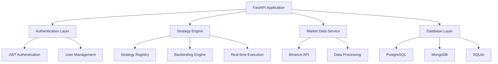

# TradingBot Documentation

Welcome to the **TradingBot** documentation! This is an advanced cryptocurrency trading bot built with FastAPI, featuring automated strategies, real-time market data integration, and comprehensive backtesting capabilities.


## 🚀 Features

- **Automated Trading Strategies** - Multiple built-in strategies with technical indicators
- **Real-time Market Data** - Binance API integration for live price feeds
- **Secure Authentication** - JWT-based user management and API security
- **Multi-Database Support** - PostgreSQL, SQLite, and MongoDB compatibility
- **Backtesting Engine** - Historical strategy validation and optimization
- **Docker Ready** - Complete containerization with Docker Compose
- **Modern API** - FastAPI with automatic OpenAPI documentation
- **Production Ready** - Comprehensive testing, logging, and monitoring

## 🎯 Quick Navigation

=== "🏁 Getting Started"

    New to TradingBot? Start here!

    - [Installation Guide](getting-started/installation.md)
    - [Quick Start Tutorial](getting-started/quick-start.md)
    - [Configuration Setup](getting-started/configuration.md)
    - [Docker Setup](getting-started/docker.md)

=== "📖 User Guide"

    Learn how to use TradingBot effectively.

    - [Overview](user-guide/overview.md)
    - [Trading Strategies](user-guide/strategies.md)
    - [API Usage](user-guide/api-usage.md)
    - [Authentication](user-guide/authentication.md)
    - [Backtesting](user-guide/backtesting.md)

=== "🔧 Development"

    Contributing to TradingBot development.

    - [Contributing Guide](development/contributing.md)
    - [Architecture Overview](development/architecture.md)
    - [Testing Guide](development/testing.md)
    - [Code Style](development/code-style.md)
    - [Database Models](development/database-models.md)

=== "🚀 Deployment"

    Deploy TradingBot to production.

    - [Production Setup](deployment/production.md)
    - [Docker Deployment](deployment/docker.md)
    - [Environment Variables](deployment/environment.md)
    - [Monitoring](deployment/monitoring.md)

## 📊 Trading Strategies

TradingBot comes with several built-in trading strategies:

| Strategy | Description | Indicators |
|----------|-------------|------------|
| **Moving Average Crossover** | Trend-following strategy using fast/slow MA | SMA, EMA |
| **RSI Reversal** | Mean reversion based on oversold/overbought levels | RSI |
| **Bollinger Bands** | Volatility-based trading signals | BB, SMA |
| **Multi-Indicator** | Combined approach using multiple indicators | RSI, MACD, BB |

## 🔗 Quick Links

- **[GitHub Repository](https://github.com/tawounfouet/tradingbot)** - Source code and issues
- **[API Documentation](api/overview.md)** - Complete API reference
- **[Live Demo](http://localhost:8000/api/v1/docs)** - Interactive API docs (when running)
- **[Contributing](development/contributing.md)** - How to contribute to the project

## 🏗️ Architecture Overview



## 📱 API Overview

The TradingBot API is built with FastAPI and provides:

- **RESTful endpoints** for all operations
- **WebSocket support** for real-time data
- **Automatic OpenAPI documentation**
- **Request/response validation** with Pydantic
- **Authentication** via JWT tokens
- **Rate limiting** and security middleware

### Base URL
```
http://localhost:8000/api/v1
```

### Authentication
```bash
curl -X POST "http://localhost:8000/api/v1/auth/login" \
     -H "Content-Type: application/json" \
     -d '{"username": "admin", "password": "admin123"}'
```

## 🎓 Learning Path

1. **Start Here**: [Installation](getting-started/installation.md) → [Quick Start](getting-started/quick-start.md)
2. **Explore**: [User Guide](user-guide/overview.md) → [Trading Strategies](user-guide/strategies.md)
3. **Develop**: [Architecture](development/architecture.md) → [Contributing](development/contributing.md)
4. **Deploy**: [Production Setup](deployment/production.md) → [Monitoring](deployment/monitoring.md)

## 🤝 Community & Support

- **Issues**: [GitHub Issues](https://github.com/tawounfouet/tradingbot/issues)
- **Discussions**: [GitHub Discussions](https://github.com/tawounfouet/tradingbot/discussions)
- **Wiki**: [Project Wiki](https://github.com/tawounfouet/tradingbot/wiki)

## ⚠️ Disclaimer

!!! warning "Important Notice"
    This software is for educational and research purposes only. Cryptocurrency trading involves significant risk of loss. Always do your own research and never invest more than you can afford to lose.

---

**Built with ❤️ using FastAPI, SQLAlchemy, and modern Python practices.**
