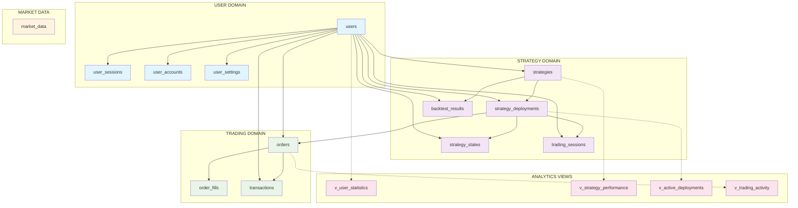
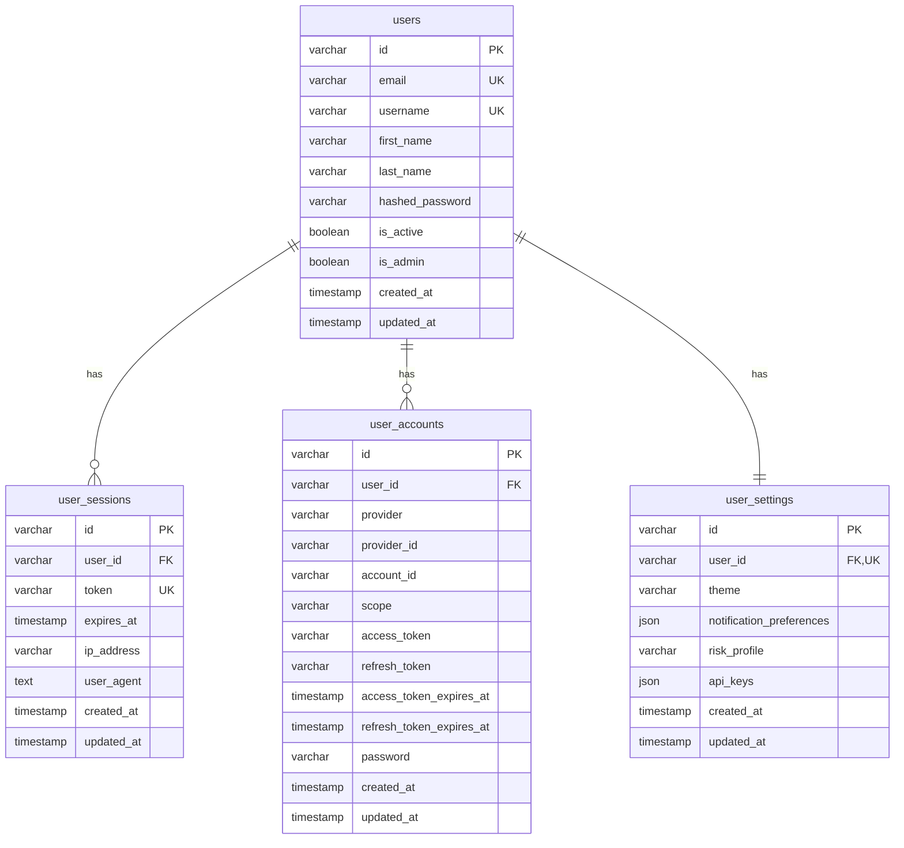
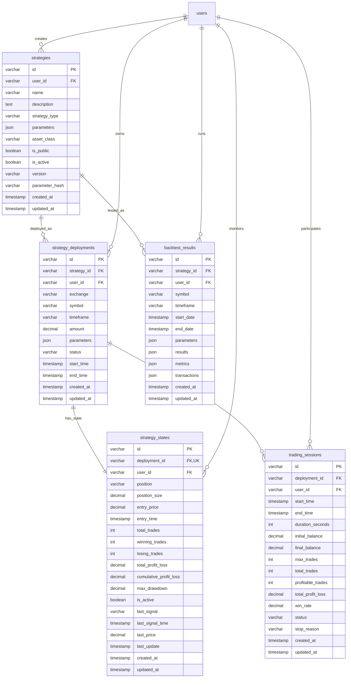
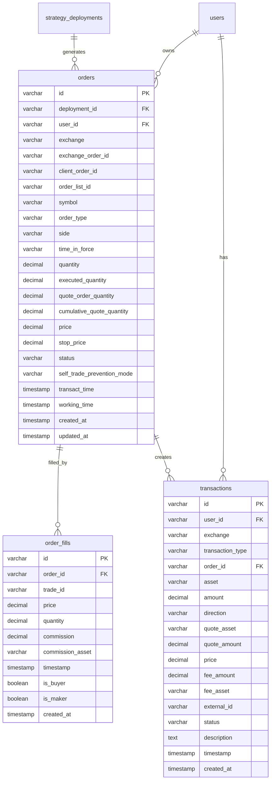
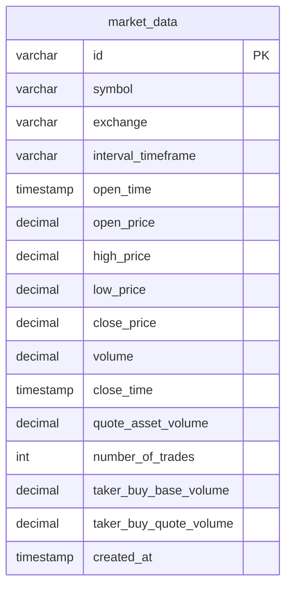
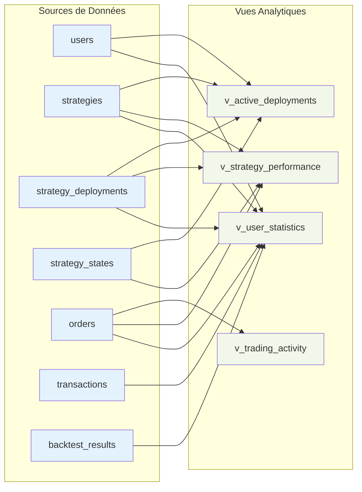
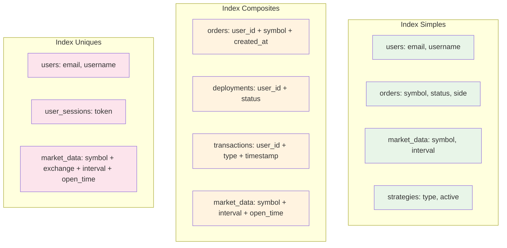
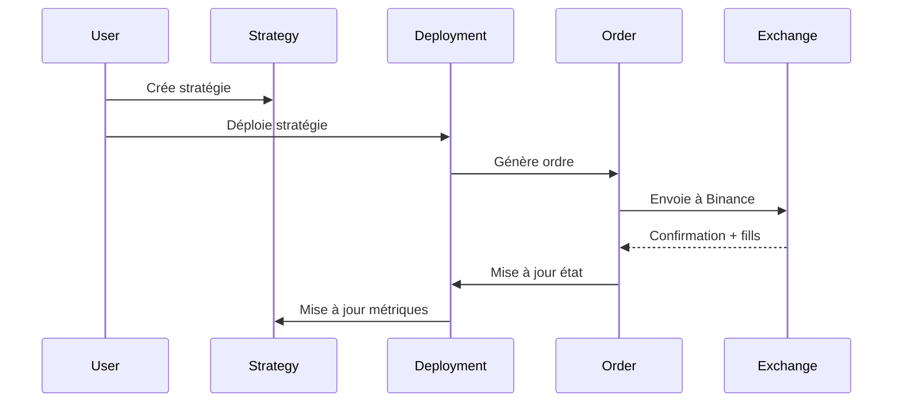
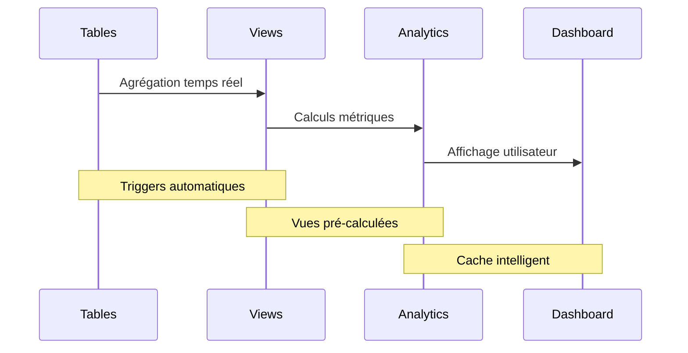

# Architecture de la Base de Données - Crypto Trading Bot

## 📋 Vue d'Ensemble

Cette documentation présente l'architecture complète de la base de données du bot de trading crypto. L'architecture suit une approche modulaire organisée par domaines métier, optimisée pour les performances et la scalabilité.

### 🎯 Objectifs de l'Architecture

- **Modulaire** : Séparation claire des domaines métier
- **Scalable** : Optimisée pour la croissance des données
- **Compatible** : Intégration native avec l'API Binance
- **Performante** : Index optimisés pour les requêtes critiques
- **Sécurisée** : Contraintes et validations appropriées

---

## 🏗️ Diagramme Global de l'Architecture



---

## 🔐 Domaine Utilisateurs (User Domain)

### Diagramme Relationnel



### 📝 Description des Tables

#### `users` - Table Principale des Utilisateurs
- **Objectif** : Stockage des informations de base des utilisateurs
- **Champs clés** :
  - `email` / `username` : Identifiants uniques
  - `hashed_password` : Mot de passe chiffré
  - `is_active` / `is_admin` : Statuts et permissions

#### `user_sessions` - Gestion des Sessions
- **Objectif** : Gestion des tokens de session et sécurité
- **Champs clés** :
  - `token` : Token de session unique
  - `expires_at` : Expiration pour la sécurité
  - `ip_address` / `user_agent` : Traçabilité des connexions

#### `user_accounts` - Authentification Multiple
- **Objectif** : Support OAuth et providers externes
- **Champs clés** :
  - `provider` : 'credentials', 'google', 'github', etc.
  - `access_token` / `refresh_token` : Tokens OAuth

#### `user_settings` - Préférences Utilisateur
- **Objectif** : Configuration personnalisée
- **Champs clés** :
  - `theme` : Interface utilisateur
  - `notification_preferences` : JSON flexible
  - `api_keys` : Clés API chiffrées (Binance, etc.)

---

## 🎯 Domaine Stratégies (Strategy Domain)

### Diagramme Relationnel



### 📝 Description des Tables

#### `strategies` - Définitions des Stratégies
- **Objectif** : Templates de stratégies de trading
- **Champs clés** :
  - `strategy_type` : 'moving_average_crossover', 'rsi_reversal', etc.
  - `parameters` : Configuration JSON flexible
  - `parameter_hash` : Cache et versionning
  - `is_public` : Partage communautaire

#### `strategy_deployments` - Instances de Trading
- **Objectif** : Déploiements actifs des stratégies
- **Champs clés** :
  - `exchange` / `symbol` / `timeframe` : Contexte de marché
  - `amount` : Capital alloué
  - `status` : 'active', 'paused', 'stopped', 'error'

#### `strategy_states` - État en Temps Réel
- **Objectif** : Suivi en direct des performances
- **Champs clés** :
  - `position` : 'LONG', 'SHORT', 'NEUTRAL'
  - `total_profit_loss` / `max_drawdown` : Métriques de performance
  - `last_signal` : Dernier signal généré

#### `trading_sessions` - Sessions de Trading
- **Objectif** : Analytics et historique des sessions
- **Champs clés** :
  - `initial_balance` / `final_balance` : Évolution du capital
  - `win_rate` : Taux de réussite
  - `duration_seconds` : Durée des sessions

#### `backtest_results` - Tests Historiques
- **Objectif** : Validation des stratégies sur données historiques
- **Champs clés** :
  - `results` / `metrics` : Résultats complets JSON
  - `transactions` : Détail des trades simulés

---

## 📈 Domaine Trading (Trading Domain)

### Diagramme Relationnel



### 📝 Description des Tables

#### `orders` - Ordres de Trading (Compatible Binance)
- **Objectif** : Gestion complète des ordres avec compatibilité API Binance
- **Champs clés** :
  - `exchange_order_id` / `client_order_id` : IDs Binance
  - `order_type` : 'MARKET', 'LIMIT', 'STOP_LOSS', etc.
  - `side` : 'BUY' / 'SELL'
  - `status` : 'NEW', 'FILLED', 'CANCELED', etc.
  - `executed_quantity` / `cumulative_quote_quantity` : Exécution

#### `order_fills` - Exécutions Partielles
- **Objectif** : Détail des fills pour ordres partiellement exécutés
- **Champs clés** :
  - `trade_id` : ID unique du trade Binance
  - `commission` / `commission_asset` : Frais détaillés
  - `is_buyer` / `is_maker` : Type d'exécution

#### `transactions` - Mouvements Financiers
- **Objectif** : Historique complet des transactions
- **Champs clés** :
  - `transaction_type` : 'TRADE', 'DEPOSIT', 'WITHDRAWAL', 'FEE'
  - `direction` : 'IN' / 'OUT'
  - `external_id` : Référence exchange

---

## 📊 Données de Marché (Market Data)

### Diagramme de la Table



### 📝 Description

#### `market_data` - Données OHLCV Historiques
- **Objectif** : Stockage des données de marché pour backtesting et analyse
- **Champs clés** :
  - **OHLCV** : `open_price`, `high_price`, `low_price`, `close_price`, `volume`
  - `interval_timeframe` : '1m', '5m', '15m', '1h', '4h', '1d'
  - **Données Binance** : `quote_asset_volume`, `taker_buy_*`
  - **Contrainte unique** : Évite les doublons par (symbol, exchange, timeframe, open_time)

---

## 📊 Vues Analytiques (Analytics Views)

### Structure des Vues



### 📝 Description des Vues

#### `v_user_statistics` - Statistiques Utilisateur
```sql
-- Agrégation des données par utilisateur
- total_strategies, total_deployments, total_orders
- net_balance (basé sur les transactions)
- total_backtests
```

#### `v_strategy_performance` - Performance des Stratégies
```sql
-- Métriques de performance par stratégie
- deployment_count, total_orders
- avg_profit_loss, avg_win_rate, max_drawdown
```

#### `v_active_deployments` - Déploiements Actifs
```sql
-- Vue temps réel des stratégies actives
- Informations de déploiement + état + performance
- Filtrée sur status='active' et end_time IS NULL
```

#### `v_trading_activity` - Activité de Trading
```sql
-- Résumé quotidien de l'activité
- Par date/exchange/symbol
- Compteurs buy/sell/filled orders
- Volume total et utilisateurs actifs
```

---

## ⚡ Optimisations de Performance

### Index Principaux



### Contraintes et Triggers

#### Triggers Automatiques
- **updated_at** : Mise à jour automatique sur toutes les tables principales
- **UUID** : Génération automatique des IDs

#### Contraintes de Sécurité
- **Foreign Keys** avec CASCADE approprié
- **Unique Keys** pour éviter les doublons
- **Check Constraints** pour la validation des données

---

## 🔄 Flux de Données Principaux

### Flux de Trading



### Flux d'Analytics



---

## 🚀 Évolutivité et Maintenance

### Stratégies de Scaling

1. **Partitioning** : Tables `market_data` et `orders` par date
2. **Archivage** : Données historiques anciennes
3. **Read Replicas** : Pour les analytics
4. **Caching** : Redis pour les données fréquentes

### Monitoring et Observabilité

1. **Métriques** : Via les vues analytiques
2. **Logs** : Audit des modifications
3. **Alertes** : Surveillance des performances
4. **Backups** : Stratégie de sauvegarde

---

## 📚 Conclusion

Cette architecture de base de données offre :

✅ **Modularité** : Domaines bien séparés  
✅ **Performance** : Index optimisés  
✅ **Compatibilité** : API Binance native  
✅ **Analytics** : Vues pré-calculées  
✅ **Sécurité** : Contraintes robustes  
✅ **Évolutivité** : Prête pour la croissance  

L'architecture est conçue pour supporter l'évolution du projet, de la phase de développement à la production en passant par les tests de charge.