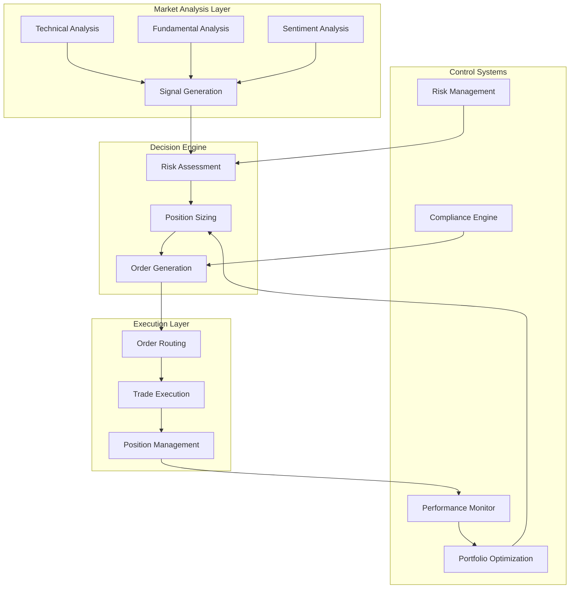

# Business Logic Documentation

## Table of Contents
- [Overview](#overview)
- [Trading Business Rules](#trading-business-rules)
- [Financial Calculations](#financial-calculations)
- [Risk Assessment Logic](#risk-assessment-logic)
- [Portfolio Management](#portfolio-management)
- [Performance Analytics](#performance-analytics)
- [Compliance and Regulations](#compliance-and-regulations)
- [Market Dynamics](#market-dynamics)
- [Decision Making Framework](#decision-making-framework)
- [Business Process Workflows](#business-process-workflows)

## Overview

This document outlines the core business logic that drives our crypto trading bot system. It covers the financial principles, trading rules, risk management practices, and decision-making frameworks that ensure profitable and compliant trading operations.

### Business Logic Architecture



### Core Business Principles

1. **Capital Preservation**: Protect capital before seeking returns
2. **Risk-Adjusted Returns**: Optimize returns per unit of risk
3. **Diversification**: Spread risk across assets and strategies
4. **Systematic Approach**: Eliminate emotional decision making
5. **Continuous Learning**: Adapt strategies based on market feedback
6. **Regulatory Compliance**: Operate within legal frameworks
7. **Transparency**: Maintain clear audit trails and reporting

## Trading Business Rules

### Entry Rules

#### Signal Validation Process

```python
class SignalValidator:
    """Validates trading signals against business rules."""
    
    def __init__(self, config: Dict):
        self.config = config
        self.min_signal_strength = config.get('min_signal_strength', 0.6)
        self.max_correlation_threshold = config.get('max_correlation', 0.8)
        self.volatility_filter = config.get('volatility_filter', True)
        
    def validate_signal(self, signal: TradingSignal, market_context: MarketContext) -> ValidationResult:
        """Comprehensive signal validation."""
        
        validation_checks = [
            self._check_signal_strength(signal),
            self._check_market_conditions(signal, market_context),
            self._check_correlation_risk(signal),
            self._check_volatility_constraints(signal, market_context),
            self._check_liquidity_requirements(signal, market_context),
            self._check_timing_constraints(signal),
            self._check_position_limits(signal)
        ]
        
        # Aggregate validation results
        result = ValidationResult()
        for check in validation_checks:
            if not check.passed:
                result.add_violation(check.rule_name, check.message)
                
        result.overall_score = self._calculate_signal_score(signal, validation_checks)
        
        return result
    
    def _check_signal_strength(self, signal: TradingSignal) -> RuleCheck:
        """Verify signal meets minimum strength requirements."""
        
        if signal.strength < self.min_signal_strength:
            return RuleCheck(
                rule_name="signal_strength",
                passed=False,
                message=f"Signal strength {signal.strength:.2f} below minimum {self.min_signal_strength}"
            )
        
        return RuleCheck(rule_name="signal_strength", passed=True)
    
    def _check_market_conditions(self, signal: TradingSignal, context: MarketContext) -> RuleCheck:
        """Check if market conditions are suitable for trading."""
        
        # Avoid trading during high volatility events
        if context.volatility_spike and signal.strategy_type in ['scalping', 'high_frequency']:
            return RuleCheck(
                rule_name="market_conditions",
                passed=False,
                message="High volatility detected - avoiding high-frequency strategies"
            )
        
        # Check market hours for traditional assets
        if context.asset_type == 'stock' and not context.market_open:
            return RuleCheck(
                rule_name="market_conditions", 
                passed=False,
                message="Market closed for traditional assets"
            )
        
        # Avoid trading during major news events
        if context.high_impact_news_pending:
            return RuleCheck(
                rule_name="market_conditions",
                passed=False,
                message="High-impact news event pending"
            )
        
        return RuleCheck(rule_name="market_conditions", passed=True)
```

#### Multi-Timeframe Confirmation

```python
class TimeframeConfirmation:
    """Implements multi-timeframe analysis for signal confirmation."""
    
    def __init__(self, timeframes: List[str] = ['1h', '4h', '1d']):
        self.timeframes = timeframes
        self.confirmation_threshold = 0.67  # 2 out of 3 timeframes must agree
        
    def get_timeframe_confirmation(self, symbol: str, signal_direction: int) -> ConfirmationResult:
        """Get confirmation from multiple timeframes."""
        
        confirmations = []
        
        for timeframe in self.timeframes:
            # Get trend direction for this timeframe
            trend_direction = self._analyze_timeframe_trend(symbol, timeframe)
            
            # Check if trend aligns with signal
            agreement = self._check_trend_alignment(signal_direction, trend_direction)
            
            confirmations.append({
                'timeframe': timeframe,
                'trend_direction': trend_direction,
                'agrees_with_signal': agreement,
                'weight': self._get_timeframe_weight(timeframe)
            })
        
        # Calculate weighted confirmation score
        weighted_score = sum(
            conf['agrees_with_signal'] * conf['weight'] 
            for conf in confirmations
        ) / sum(conf['weight'] for conf in confirmations)
        
        return ConfirmationResult(
            confirmations=confirmations,
            overall_score=weighted_score,
            confirmed=weighted_score >= self.confirmation_threshold
        )
    
    def _analyze_timeframe_trend(self, symbol: str, timeframe: str) -> float:
        """Analyze trend direction for specific timeframe."""
        
        # Get historical data for timeframe
        data = self.market_data_service.get_historical_data(
            symbol=symbol,
            timeframe=timeframe,
            periods=50
        )
        
        if data is None or len(data) < 20:
            return 0.0  # Neutral if insufficient data
        
        # Calculate multiple trend indicators
        sma_20 = data['close'].rolling(20).mean()
        sma_50 = data['close'].rolling(50).mean()
        
        # Trend direction based on moving averages
        if len(sma_20) >= 2 and len(sma_50) >= 2:
            current_price = data['close'].iloc[-1]
            sma_20_current = sma_20.iloc[-1]
            sma_50_current = sma_50.iloc[-1]
            
            # Strong bullish: price > SMA20 > SMA50 and SMAs rising
            if (current_price > sma_20_current > sma_50_current and
                sma_20_current > sma_20.iloc[-2] and
                sma_50_current > sma_50.iloc[-2]):
                return 1.0
            
            # Strong bearish: price < SMA20 < SMA50 and SMAs falling
            elif (current_price < sma_20_current < sma_50_current and
                  sma_20_current < sma_20.iloc[-2] and
                  sma_50_current < sma_50.iloc[-2]):
                return -1.0
            
            # Moderate trends
            elif current_price > sma_20_current:
                return 0.5
            elif current_price < sma_20_current:
                return -0.5
        
        return 0.0  # Neutral
```

### Exit Rules

#### Profit Taking Strategy

```python
class ProfitTakingStrategy:
    """Implements systematic profit taking rules."""
    
    def __init__(self, config: Dict):
        self.config = config
        self.partial_take_levels = config.get('partial_take_levels', [0.5, 1.0, 2.0])  # Risk multiples
        self.partial_take_percentages = config.get('partial_take_percentages', [25, 50, 75])
        self.trailing_stop_activation = config.get('trailing_stop_activation', 1.0)  # 1R
        
    def calculate_exit_levels(self, entry_price: float, stop_loss: float, 
                            position_size: float) -> ExitPlan:
        """Calculate systematic exit levels."""
        
        risk_amount = abs(entry_price - stop_loss)
        
        exit_plan = ExitPlan(
            entry_price=entry_price,
            initial_stop_loss=stop_loss,
            position_size=position_size
        )
        
        # Calculate partial take profit levels
        for i, level in enumerate(self.partial_take_levels):
            target_price = entry_price + (risk_amount * level)
            take_percentage = self.partial_take_percentages[i]
            
            exit_plan.add_take_profit_level(
                price=target_price,
                percentage=take_percentage / 100,
                description=f"Take profit {i+1}: {take_percentage}% at {level}R"
            )
        
        # Set trailing stop activation
        trailing_activation_price = entry_price + (risk_amount * self.trailing_stop_activation)
        exit_plan.set_trailing_stop(
            activation_price=trailing_activation_price,
            trail_amount=risk_amount * 0.5  # Trail by 0.5R
        )
        
        return exit_plan
    
    def update_exit_plan(self, exit_plan: ExitPlan, current_price: float, 
                        current_high: float) -> ExitPlan:
        """Update exit plan based on current market conditions."""
        
        updated_plan = copy.deepcopy(exit_plan)
        
        # Check if any take profit levels should be executed
        for level in updated_plan.take_profit_levels:
            if not level.executed and current_price >= level.price:
                level.executed = True
                level.execution_price = current_price
                updated_plan.remaining_position_size *= (1 - level.percentage)
        
        # Update trailing stop if activated
        if (updated_plan.trailing_stop and 
            current_high >= updated_plan.trailing_stop.activation_price):
            
            new_stop = current_high - updated_plan.trailing_stop.trail_amount
            updated_plan.current_stop_loss = max(updated_plan.current_stop_loss, new_stop)
        
        return updated_plan
```

#### Dynamic Stop Loss Management

```python
class DynamicStopLossManager:
    """Manages dynamic stop loss adjustments based on market conditions."""
    
    def __init__(self, config: Dict):
        self.config = config
        self.volatility_multiplier = config.get('volatility_multiplier', 2.0)
        self.atr_period = config.get('atr_period', 14)
        self.min_stop_distance = config.get('min_stop_distance', 0.005)  # 0.5%
        
    def calculate_optimal_stop_loss(self, symbol: str, entry_price: float, 
                                  direction: int) -> float:
        """Calculate optimal stop loss based on market volatility."""
        
        # Get recent market data
        data = self.market_data_service.get_historical_data(
            symbol=symbol,
            timeframe='1h',
            periods=self.atr_period + 10
        )
        
        if data is None or len(data) < self.atr_period:
            # Fallback to fixed percentage
            fallback_stop = entry_price * (1 - self.min_stop_distance * direction)
            return fallback_stop
        
        # Calculate Average True Range (ATR)
        atr = self._calculate_atr(data)
        current_atr = atr.iloc[-1]
        
        # Calculate volatility-adjusted stop distance
        stop_distance = current_atr * self.volatility_multiplier
        
        # Ensure minimum stop distance
        min_distance = entry_price * self.min_stop_distance
        stop_distance = max(stop_distance, min_distance)
        
        # Calculate stop loss price
        if direction > 0:  # Long position
            stop_loss = entry_price - stop_distance
        else:  # Short position
            stop_loss = entry_price + stop_distance
        
        return stop_loss
    
    def _calculate_atr(self, data: pd.DataFrame) -> pd.Series:
        """Calculate Average True Range."""
        
        high_low = data['high'] - data['low']
        high_close = abs(data['high'] - data['close'].shift())
        low_close = abs(data['low'] - data['close'].shift())
        
        true_range = pd.concat([high_low, high_close, low_close], axis=1).max(axis=1)
        atr = true_range.rolling(window=self.atr_period).mean()
        
        return atr
```

## Financial Calculations

### Position Sizing Models

```python
class PositionSizingCalculator:
    """Calculates optimal position sizes using various risk models."""
    
    def __init__(self, config: Dict):
        self.config = config
        self.max_risk_per_trade = config.get('max_risk_per_trade', 0.02)  # 2%
        self.max_portfolio_risk = config.get('max_portfolio_risk', 0.06)  # 6%
        self.correlation_adjustment = config.get('correlation_adjustment', True)
        
    def calculate_position_size(self, signal: TradingSignal, portfolio: Portfolio, 
                              method: str = 'fixed_risk') -> PositionSize:
        """Calculate position size using specified method."""
        
        if method == 'fixed_risk':
            return self._fixed_risk_sizing(signal, portfolio)
        elif method == 'kelly_criterion':
            return self._kelly_criterion_sizing(signal, portfolio)
        elif method == 'volatility_adjusted':
            return self._volatility_adjusted_sizing(signal, portfolio)
        else:
            raise ValueError(f"Unknown position sizing method: {method}")
    
    def _fixed_risk_sizing(self, signal: TradingSignal, portfolio: Portfolio) -> PositionSize:
        """Calculate position size based on fixed risk percentage."""
        
        # Calculate risk amount per trade
        risk_amount = portfolio.total_value * self.max_risk_per_trade
        
        # Calculate stop loss distance
        entry_price = signal.price or signal.current_market_price
        stop_loss_price = signal.stop_loss_price
        
        if not stop_loss_price:
            # Use default stop loss
            default_stop_pct = self.config.get('default_stop_loss', 0.02)
            stop_loss_price = entry_price * (1 - default_stop_pct * signal.direction)
        
        stop_distance = abs(entry_price - stop_loss_price)
        
        # Calculate position size
        if stop_distance > 0:
            position_value = risk_amount / (stop_distance / entry_price)
            quantity = position_value / entry_price
        else:
            quantity = 0
        
        # Apply portfolio-level risk adjustments
        adjusted_quantity = self._apply_portfolio_risk_adjustments(
            quantity, signal, portfolio
        )
        
        return PositionSize(
            quantity=adjusted_quantity,
            value=adjusted_quantity * entry_price,
            risk_amount=risk_amount,
            risk_percentage=self.max_risk_per_trade,
            method='fixed_risk'
        )
    
    def _kelly_criterion_sizing(self, signal: TradingSignal, portfolio: Portfolio) -> PositionSize:
        """Calculate position size using Kelly Criterion."""
        
        # Get historical performance for this strategy/signal type
        historical_data = self._get_strategy_performance_history(signal.strategy_id)
        
        if not historical_data or len(historical_data.trades) < 30:
            # Fall back to fixed risk if insufficient data
            return self._fixed_risk_sizing(signal, portfolio)
        
        # Calculate win rate and average win/loss
        trades = historical_data.trades
        wins = [t for t in trades if t.pnl > 0]
        losses = [t for t in trades if t.pnl < 0]
        
        win_rate = len(wins) / len(trades)
        avg_win = sum(t.pnl_percentage for t in wins) / len(wins) if wins else 0
        avg_loss = abs(sum(t.pnl_percentage for t in losses) / len(losses)) if losses else 0
        
        # Kelly formula: f = (bp - q) / b
        # where b = odds received (avg_win/avg_loss), p = win_rate, q = 1-p
        if avg_loss > 0:
            b = avg_win / avg_loss
            kelly_fraction = (b * win_rate - (1 - win_rate)) / b
        else:
            kelly_fraction = 0
        
        # Apply Kelly fraction with safety constraints
        kelly_fraction = max(0, min(kelly_fraction, 0.25))  # Cap at 25%
        
        # Calculate position size
        position_value = portfolio.total_value * kelly_fraction
        entry_price = signal.price or signal.current_market_price
        quantity = position_value / entry_price
        
        # Apply additional risk constraints
        adjusted_quantity = self._apply_portfolio_risk_adjustments(
            quantity, signal, portfolio
        )
        
        return PositionSize(
            quantity=adjusted_quantity,
            value=adjusted_quantity * entry_price,
            risk_amount=position_value * self.max_risk_per_trade,
            risk_percentage=kelly_fraction,
            method='kelly_criterion',
            kelly_fraction=kelly_fraction
        )
```

### Performance Metrics

```python
class PerformanceAnalyzer:
    """Calculates comprehensive performance metrics."""
    
    def __init__(self):
        self.risk_free_rate = 0.02  # 2% annual risk-free rate
        
    def calculate_portfolio_metrics(self, trades: List[Trade], 
                                  portfolio_values: List[float]) -> PerformanceMetrics:
        """Calculate comprehensive portfolio performance metrics."""
        
        if not trades or not portfolio_values:
            return PerformanceMetrics()
        
        # Convert to pandas for easier calculation
        df = pd.DataFrame({
            'portfolio_value': portfolio_values,
            'timestamp': [t.timestamp for t in trades]
        })
        df.set_index('timestamp', inplace=True)
        
        # Calculate returns
        df['returns'] = df['portfolio_value'].pct_change()
        df['cumulative_returns'] = (1 + df['returns']).cumprod() - 1
        
        # Basic metrics
        total_return = df['cumulative_returns'].iloc[-1]
        total_trades = len(trades)
        winning_trades = sum(1 for t in trades if t.pnl > 0)
        win_rate = winning_trades / total_trades if total_trades > 0 else 0
        
        # Risk metrics
        volatility = df['returns'].std() * np.sqrt(252)  # Annualized
        sharpe_ratio = self._calculate_sharpe_ratio(df['returns'])
        sortino_ratio = self._calculate_sortino_ratio(df['returns'])
        max_drawdown = self._calculate_max_drawdown(df['portfolio_value'])
        
        # Advanced metrics
        calmar_ratio = total_return / abs(max_drawdown) if max_drawdown < 0 else 0
        var_95 = np.percentile(df['returns'].dropna(), 5)
        cvar_95 = df['returns'][df['returns'] <= var_95].mean()
        
        # Trade analysis
        avg_trade_return = sum(t.pnl_percentage for t in trades) / total_trades
        avg_win = sum(t.pnl_percentage for t in trades if t.pnl > 0) / winning_trades if winning_trades > 0 else 0
        avg_loss = sum(t.pnl_percentage for t in trades if t.pnl < 0) / (total_trades - winning_trades) if (total_trades - winning_trades) > 0 else 0
        profit_factor = abs(avg_win / avg_loss) if avg_loss != 0 else float('inf')
        
        return PerformanceMetrics(
            # Return metrics
            total_return=total_return,
            annualized_return=self._annualize_return(total_return, len(df)),
            
            # Risk metrics
            volatility=volatility,
            sharpe_ratio=sharpe_ratio,
            sortino_ratio=sortino_ratio,
            max_drawdown=max_drawdown,
            calmar_ratio=calmar_ratio,
            
            # Risk measures
            var_95=var_95,
            cvar_95=cvar_95,
            
            # Trade metrics
            total_trades=total_trades,
            win_rate=win_rate,
            avg_trade_return=avg_trade_return,
            avg_win=avg_win,
            avg_loss=avg_loss,
            profit_factor=profit_factor,
            
            # Consistency metrics
            monthly_win_rate=self._calculate_monthly_win_rate(df),
            recovery_factor=total_return / abs(max_drawdown) if max_drawdown < 0 else float('inf')
        )
    
    def _calculate_sharpe_ratio(self, returns: pd.Series) -> float:
        """Calculate Sharpe ratio."""
        excess_returns = returns - (self.risk_free_rate / 252)  # Daily risk-free rate
        return excess_returns.mean() / excess_returns.std() * np.sqrt(252) if excess_returns.std() != 0 else 0
    
    def _calculate_sortino_ratio(self, returns: pd.Series) -> float:
        """Calculate Sortino ratio (using downside deviation)."""
        excess_returns = returns - (self.risk_free_rate / 252)
        downside_returns = excess_returns[excess_returns < 0]
        downside_std = downside_returns.std() * np.sqrt(252)
        
        return excess_returns.mean() * np.sqrt(252) / downside_std if downside_std != 0 else 0
    
    def _calculate_max_drawdown(self, portfolio_values: pd.Series) -> float:
        """Calculate maximum drawdown."""
        peak = portfolio_values.expanding().max()
        drawdown = (portfolio_values - peak) / peak
        return drawdown.min()
```

## Risk Assessment Logic

### Market Risk Models

```python
class MarketRiskAssessment:
    """Comprehensive market risk assessment framework."""
    
    def __init__(self, config: Dict):
        self.config = config
        self.correlation_threshold = config.get('correlation_threshold', 0.7)
        self.volatility_lookback = config.get('volatility_lookback', 30)
        self.liquidity_threshold = config.get('liquidity_threshold', 1000000)  # $1M daily volume
        
    def assess_market_risk(self, signal: TradingSignal, portfolio: Portfolio, 
                          market_data: MarketData) -> RiskAssessment:
        """Comprehensive market risk assessment."""
        
        risk_factors = [
            self._assess_volatility_risk(signal, market_data),
            self._assess_liquidity_risk(signal, market_data),
            self._assess_correlation_risk(signal, portfolio),
            self._assess_concentration_risk(signal, portfolio),
            self._assess_market_regime_risk(signal, market_data),
            self._assess_news_sentiment_risk(signal, market_data)
        ]
        
        # Calculate overall risk score
        risk_scores = [rf.risk_score for rf in risk_factors]
        overall_risk = np.mean(risk_scores)
        
        # Determine risk level
        if overall_risk < 0.3:
            risk_level = RiskLevel.LOW
        elif overall_risk < 0.6:
            risk_level = RiskLevel.MEDIUM
        elif overall_risk < 0.8:
            risk_level = RiskLevel.HIGH
        else:
            risk_level = RiskLevel.VERY_HIGH
        
        return RiskAssessment(
            overall_risk_score=overall_risk,
            risk_level=risk_level,
            risk_factors=risk_factors,
            recommendations=self._generate_risk_recommendations(risk_factors),
            position_size_adjustment=self._calculate_risk_adjustment(overall_risk)
        )
    
    def _assess_volatility_risk(self, signal: TradingSignal, market_data: MarketData) -> RiskFactor:
        """Assess volatility-based risk."""
        
        # Get historical volatility
        historical_data = market_data.get_historical_volatility(
            symbol=signal.symbol,
            periods=self.volatility_lookback
        )
        
        current_volatility = historical_data.current_volatility
        avg_volatility = historical_data.average_volatility
        volatility_percentile = historical_data.volatility_percentile
        
        # Calculate risk score based on volatility
        if volatility_percentile > 90:  # Very high volatility
            risk_score = 0.9
            message = f"Extreme volatility: {current_volatility:.2%} (90th+ percentile)"
        elif volatility_percentile > 75:  # High volatility
            risk_score = 0.7
            message = f"High volatility: {current_volatility:.2%} (75th+ percentile)"
        elif volatility_percentile < 25:  # Low volatility
            risk_score = 0.2
            message = f"Low volatility: {current_volatility:.2%} (25th- percentile)"
        else:  # Normal volatility
            risk_score = 0.4
            message = f"Normal volatility: {current_volatility:.2%}"
        
        return RiskFactor(
            name="volatility_risk",
            risk_score=risk_score,
            message=message,
            data={
                'current_volatility': current_volatility,
                'average_volatility': avg_volatility,
                'volatility_percentile': volatility_percentile
            }
        )
    
    def _assess_correlation_risk(self, signal: TradingSignal, portfolio: Portfolio) -> RiskFactor:
        """Assess correlation risk with existing positions."""
        
        if not portfolio.positions:
            return RiskFactor(
                name="correlation_risk",
                risk_score=0.1,
                message="No existing positions - minimal correlation risk"
            )
        
        # Calculate correlations with existing positions
        correlations = []
        for position in portfolio.positions:
            if position.symbol != signal.symbol:
                corr = self._calculate_correlation(signal.symbol, position.symbol)
                correlations.append({
                    'symbol': position.symbol,
                    'correlation': corr,
                    'position_weight': position.weight
                })
        
        # Calculate weighted average correlation
        if correlations:
            weighted_corr = sum(
                c['correlation'] * c['position_weight'] 
                for c in correlations
            ) / sum(c['position_weight'] for c in correlations)
            
            # Risk score based on correlation
            if abs(weighted_corr) > 0.8:
                risk_score = 0.9
                message = f"Very high correlation ({weighted_corr:.2f}) with existing positions"
            elif abs(weighted_corr) > 0.6:
                risk_score = 0.7
                message = f"High correlation ({weighted_corr:.2f}) with existing positions"
            elif abs(weighted_corr) > 0.4:
                risk_score = 0.5
                message = f"Moderate correlation ({weighted_corr:.2f}) with existing positions"
            else:
                risk_score = 0.2
                message = f"Low correlation ({weighted_corr:.2f}) with existing positions"
        else:
            risk_score = 0.1
            weighted_corr = 0
            message = "No correlation data available"
        
        return RiskFactor(
            name="correlation_risk",
            risk_score=risk_score,
            message=message,
            data={
                'weighted_correlation': weighted_corr,
                'individual_correlations': correlations
            }
        )
```

### Portfolio Risk Monitoring

```python
class PortfolioRiskMonitor:
    """Real-time portfolio risk monitoring and alerting."""
    
    def __init__(self, config: Dict):
        self.config = config
        self.max_portfolio_var = config.get('max_portfolio_var', 0.05)  # 5% daily VaR
        self.max_sector_concentration = config.get('max_sector_concentration', 0.3)  # 30%
        self.max_single_position = config.get('max_single_position', 0.1)  # 10%
        
    def monitor_portfolio_risk(self, portfolio: Portfolio) -> RiskMonitoringResult:
        """Continuously monitor portfolio risk metrics."""
        
        risk_violations = []
        risk_warnings = []
        
        # Check Value at Risk
        portfolio_var = self._calculate_portfolio_var(portfolio)
        if portfolio_var > self.max_portfolio_var:
            risk_violations.append(
                RiskViolation(
                    type="portfolio_var",
                    severity="high",
                    message=f"Portfolio VaR ({portfolio_var:.2%}) exceeds limit ({self.max_portfolio_var:.2%})",
                    current_value=portfolio_var,
                    limit=self.max_portfolio_var
                )
            )
        
        # Check position concentration
        for position in portfolio.positions:
            if position.weight > self.max_single_position:
                risk_violations.append(
                    RiskViolation(
                        type="position_concentration",
                        severity="medium",
                        message=f"Position {position.symbol} ({position.weight:.2%}) exceeds single position limit",
                        current_value=position.weight,
                        limit=self.max_single_position
                    )
                )
        
        # Check sector concentration
        sector_exposures = self._calculate_sector_exposures(portfolio)
        for sector, exposure in sector_exposures.items():
            if exposure > self.max_sector_concentration:
                risk_violations.append(
                    RiskViolation(
                        type="sector_concentration",
                        severity="medium",
                        message=f"Sector {sector} exposure ({exposure:.2%}) exceeds limit",
                        current_value=exposure,
                        limit=self.max_sector_concentration
                    )
                )
        
        # Check correlation clustering
        correlation_clusters = self._detect_correlation_clusters(portfolio)
        for cluster in correlation_clusters:
            if cluster.total_weight > 0.5:  # More than 50% in correlated assets
                risk_warnings.append(
                    RiskWarning(
                        type="correlation_clustering",
                        message=f"High correlation cluster detected: {cluster.symbols} (weight: {cluster.total_weight:.2%})"
                    )
                )
        
        # Calculate overall risk score
        overall_risk_score = self._calculate_overall_risk_score(
            portfolio_var, sector_exposures, correlation_clusters
        )
        
        return RiskMonitoringResult(
            timestamp=datetime.utcnow(),
            overall_risk_score=overall_risk_score,
            portfolio_var=portfolio_var,
            violations=risk_violations,
            warnings=risk_warnings,
            sector_exposures=sector_exposures,
            recommendations=self._generate_risk_mitigation_recommendations(risk_violations)
        )
```

## Decision Making Framework

### Strategy Selection Logic

```python
class StrategySelector:
    """Intelligent strategy selection based on market conditions."""
    
    def __init__(self, config: Dict):
        self.config = config
        self.available_strategies = self._load_available_strategies()
        self.market_regime_detector = MarketRegimeDetector()
        
    def select_optimal_strategy(self, market_context: MarketContext, 
                              portfolio: Portfolio) -> StrategySelection:
        """Select optimal strategy based on current conditions."""
        
        # Detect current market regime
        market_regime = self.market_regime_detector.detect_regime(market_context)
        
        # Score each strategy for current conditions
        strategy_scores = []
        
        for strategy in self.available_strategies:
            score = self._score_strategy_for_conditions(
                strategy, market_regime, market_context, portfolio
            )
            strategy_scores.append((strategy, score))
        
        # Sort by score and select top strategies
        strategy_scores.sort(key=lambda x: x[1].total_score, reverse=True)
        
        # Apply portfolio diversification constraints
        selected_strategies = self._apply_diversification_constraints(
            strategy_scores, portfolio
        )
        
        return StrategySelection(
            primary_strategy=selected_strategies[0] if selected_strategies else None,
            alternative_strategies=selected_strategies[1:3],  # Top 2 alternatives
            market_regime=market_regime,
            selection_rationale=self._generate_selection_rationale(
                selected_strategies, market_regime
            )
        )
    
    def _score_strategy_for_conditions(self, strategy: Strategy, 
                                     market_regime: MarketRegime,
                                     market_context: MarketContext,
                                     portfolio: Portfolio) -> StrategyScore:
        """Score strategy fitness for current market conditions."""
        
        # Historical performance in similar conditions
        historical_score = self._score_historical_performance(strategy, market_regime)
        
        # Market condition fitness
        market_fitness_score = self._score_market_fitness(strategy, market_context)
        
        # Portfolio diversification benefit
        diversification_score = self._score_diversification_benefit(strategy, portfolio)
        
        # Risk-adjusted scoring
        risk_score = self._score_risk_characteristics(strategy, market_context)
        
        # Capacity and liquidity constraints
        capacity_score = self._score_capacity_constraints(strategy, portfolio)
        
        # Combine scores with weights
        weights = self.config.get('strategy_scoring_weights', {
            'historical': 0.3,
            'market_fitness': 0.25,
            'diversification': 0.2,
            'risk': 0.15,
            'capacity': 0.1
        })
        
        total_score = (
            historical_score * weights['historical'] +
            market_fitness_score * weights['market_fitness'] +
            diversification_score * weights['diversification'] +
            risk_score * weights['risk'] +
            capacity_score * weights['capacity']
        )
        
        return StrategyScore(
            strategy=strategy,
            total_score=total_score,
            component_scores={
                'historical': historical_score,
                'market_fitness': market_fitness_score,
                'diversification': diversification_score,
                'risk': risk_score,
                'capacity': capacity_score
            }
        )
```

### Market Regime Detection

```python
class MarketRegimeDetector:
    """Detect current market regime for strategy adaptation."""
    
    def __init__(self):
        self.lookback_periods = {
            'short': 20,   # 20 periods for short-term regime
            'medium': 60,  # 60 periods for medium-term regime
            'long': 252    # 252 periods for long-term regime
        }
        
    def detect_regime(self, market_context: MarketContext) -> MarketRegime:
        """Detect current market regime across multiple timeframes."""
        
        regimes = {}
        
        for timeframe, periods in self.lookback_periods.items():
            regime = self._analyze_regime_for_timeframe(
                market_context.price_data, periods
            )
            regimes[timeframe] = regime
        
        # Combine timeframe regimes into overall assessment
        overall_regime = self._synthesize_regime_analysis(regimes)
        
        return MarketRegime(
            overall_regime=overall_regime,
            timeframe_regimes=regimes,
            confidence=self._calculate_regime_confidence(regimes),
            characteristics=self._extract_regime_characteristics(market_context)
        )
    
    def _analyze_regime_for_timeframe(self, price_data: pd.DataFrame, 
                                    periods: int) -> RegimeAnalysis:
        """Analyze market regime for specific timeframe."""
        
        if len(price_data) < periods:
            return RegimeAnalysis(regime='unknown', confidence=0.0)
        
        recent_data = price_data.tail(periods)
        
        # Calculate regime indicators
        trend_strength = self._calculate_trend_strength(recent_data)
        volatility_regime = self._classify_volatility_regime(recent_data)
        momentum_regime = self._classify_momentum_regime(recent_data)
        
        # Classify overall regime
        if trend_strength > 0.6:
            if recent_data['close'].iloc[-1] > recent_data['close'].iloc[0]:
                regime = 'bull_trending'
            else:
                regime = 'bear_trending'
        elif trend_strength < 0.3:
            if volatility_regime == 'high':
                regime = 'high_volatility_ranging'
            else:
                regime = 'low_volatility_ranging'
        else:
            regime = 'transitional'
        
        # Calculate confidence based on consistency of signals
        confidence = self._calculate_signal_consistency(
            trend_strength, volatility_regime, momentum_regime
        )
        
        return RegimeAnalysis(
            regime=regime,
            confidence=confidence,
            trend_strength=trend_strength,
            volatility_regime=volatility_regime,
            momentum_regime=momentum_regime
        )
```

This comprehensive business logic documentation provides the foundation for understanding the financial and trading principles that drive our crypto bot system. It covers all aspects from signal validation to risk management, ensuring profitable and compliant trading operations.
